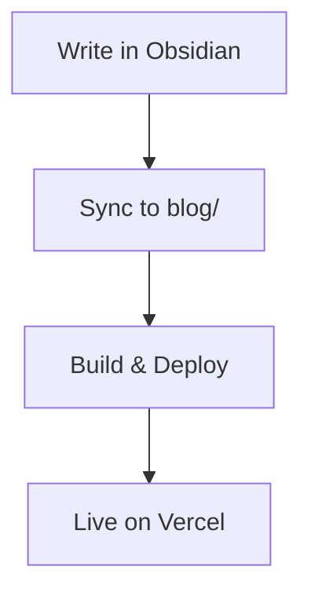

<p align="center">
  
</p>

<h1 align="center">Second Brain</h1>

<p align="center">
  <strong>Where Ideas Crystallize Into Knowledge</strong>
</p>

<p align="center">
  A premium personal knowledge base and blog write in Obsidian, publish to the web. Interactive code playgrounds, knowledge graphs, math, diagrams, and a polished dark/gold design system. Built with Next.js, zero external services required.
</p>

<p align="center">
  
  
  
  
  
  
</p>

---

## Table of Contents

- [Why Second Brain?](#why-second-brain)
- [Live Demo](#live-demo)
- [Features](#features)
  - [Writing & Content](#writing--content)
  - [Interactive Code Playground](#interactive-code-playground)
  - [Knowledge Graph](#knowledge-graph)
  - [Reading Experience](#reading-experience)
  - [UI & Design](#ui--design)
  - [SEO & Distribution](#seo--distribution)
- [Tech Stack](#tech-stack)
- [Project Structure](#project-structure)
- [Getting Started](#getting-started)
  - [Prerequisites](#prerequisites)
  - [Installation](#installation)
  - [Development](#development)
- [Writing Posts](#writing-posts)
  - [Frontmatter](#frontmatter)
  - [Wiki-Links](#wiki-links)
  - [Code Blocks](#code-blocks)
  - [Math (KaTeX)](#math-katex)
  - [Diagrams (Mermaid)](#diagrams-mermaid)
  - [Media Embeds](#media-embeds)
  - [Obsidian Ink](#obsidian-ink)
- [Obsidian Workflow](#obsidian-workflow)
  - [Setup](#setup)
  - [Daily Publishing](#daily-publishing)
  - [Sync Script Details](#sync-script-details)
- [Deployment](#deployment)
  - [Vercel (Recommended)](#vercel-recommended)
  - [Docker](#docker)
  - [Any Node.js Host](#any-nodejs-host)
- [Configuration](#configuration)
  - [Environment Variables](#environment-variables)
  - [Customization](#customization)
- [Scripts Reference](#scripts-reference)
- [License](#license)

---

## Why Second Brain?

Most blogs are either static site generators that require complex toolchains, or hosted platforms that lock you in. Second Brain is different:

- **Write in Obsidian** — your notes are your blog posts. Use wiki-links, backlinks, and your existing workflow.
- **Zero external services** — no database server, no CMS, no API keys needed. Everything runs out of the box.
- **Interactive content** — readers can run code, explore knowledge graphs, and hover-preview linked posts.
- **Deploy for free** — Vercel free tier handles everything. No server costs, no configuration.
- **Markdown-first** — write in plain markdown with standard frontmatter. No proprietary formats.

---

## Live Demo

> 🚀 See it live at [second-brain-five-xi.vercel.app](https://second-brain-five-xi.vercel.app/)

---

## Features

### Writing & Content

| Feature | Description |
|---------|-------------|
| **Markdown pipeline** | GFM tables, strikethrough, task lists, syntax highlighting (Shiki — one-dark-pro / one-light themes) |
| **Wiki-links** | `[[post-slug]]` syntax from Obsidian, converted to interactive links with hover previews |
| **Broken link detection** | Links to non-existent posts get a distinct visual style so you can fix them |
| **Math rendering** | LaTeX equations via KaTeX — inline `$e=mc^2$` and block `$$...$$` |
| **Diagrams** | Mermaid flowcharts, sequence diagrams, Gantt charts rendered client-side |
| **Media embeds** | YouTube/Vimeo (lazy-loaded thumbnails), PDF viewer, HTML5 audio player |
| **Obsidian Ink** | Hand-drawn SVG sketches from the Obsidian Ink plugin, themed for light/dark |

### Interactive Code Playground

Every code block with a supported language gets a **Run** button. Readers can execute code directly in their browser — no setup, no server needed for most languages.

**Browser-native (zero server dependency):**

| Language | Runtime | Notes |
|----------|---------|-------|
| JavaScript | `async Function` constructor | Full console interception (log, error, warn, info, table, clear) |
| TypeScript | Transpiled via Function | Same as JavaScript |
| Python | [Pyodide](https://pyodide.org) (WebAssembly) | Supports `print()`, `input()`, and standard library |

**Server-side (free, no auth required):**

| Language | Backend | Notes |
|----------|---------|-------|
| C, C++ | Judge0 CE | `ce.judge0.com` — public instance, no API key |
| Java | Judge0 CE | |
| Rust | Judge0 CE | |
| Go | Judge0 CE | |
| Ruby, PHP, Bash, Kotlin, Scala, Lua, R, Swift | Judge0 CE | |

**Execution fallback chain:**

```
Local code-runner (dev only)
    → ce.judge0.com (free, no auth — production)
        → Judge0 CE RapidAPI (optional, if JUDGE0_API_KEY set)
```

**Code block features:**
- Colored language badges with per-language color coding
- "⚡ Browser" / "🐍 Pyodide" environment tags
- Stdin input textarea for languages that need user input
- Output panel with stdout (white) and stderr (red) sections
- Copy button on every code block

### Knowledge Graph

A D3.js force-directed graph that visualizes connections between your posts via wiki-links:

- Nodes sized by connection count, colored by category
- Full-screen modal view with zoom/pan
- Inline graph shown on each post showing its connections
- Click a node to navigate to that post
- Smooth physics-based animation

### Reading Experience

| Feature | Description |
|---------|-------------|
| **Reading progress bar** | Thin gold bar at the top showing scroll progress |
| **Table of contents** | Desktop sidebar TOC with scroll-spy active heading tracking; mobile drawer |
| **Reading position memory** | Remembers your scroll position per article (localStorage) |
| **Reading streaks** | Tracks consecutive days of reading with a flame counter |
| **Reading history** | Recently read articles shown on the home page |
| **Bookmarks** | Save posts to read later (localStorage, syncs across views) |
| **Command palette search** | `Cmd+K` / `Ctrl+K` fuzzy search across titles, content, tags, categories |
| **SPA navigation** | Client-side page transitions with Framer Motion — no full page reloads |

### UI & Design

- **Dark-first design** with warm gold (`#e2b340`) accent on near-black backgrounds
- **Full light mode** — toggles all surfaces, text, and code themes
- **Animated hero** — gradient orbs, grid texture overlay, animated stat counters
- **Blog grid/list toggle** — switch between card grid and compact list views
- **Animated tag cloud** — tag sizes proportional to post count
- **Responsive** — mobile-optimized layouts, hamburger menu, mobile TOC drawer
- **Keyboard shortcuts** — `Cmd+K` search, `?` for shortcuts dialog, `T` for theme toggle
- **Breadcrumb navigation** on post pages
- **Back to top** button with scroll threshold
- **Social share buttons** on posts
- **Smooth page transitions** via Framer Motion

### SEO & Distribution

| Feature | Description |
|---------|-------------|
| **Dynamic OG images** | Per-post SVG Open Graph images with category, title, and date |
| **RSS 2.0 feed** | Full-content RSS at `/api/rss` |
| **XML Sitemap** | Auto-generated at `/api/sitemap.xml` with priority and changefreq |
| **robots.txt** | Configured for all major search engines |

---

## Tech Stack

| Layer | Technology |
|-------|-----------|
| **Framework** | Next.js 16 (App Router, standalone output) |
| **Runtime** | Bun (also compatible with Node.js) |
| **Language** | TypeScript 5 |
| **React** | React 19 |
| **Styling** | Tailwind CSS 4 + shadcn/ui (New York style) |
| **Animations** | Framer Motion 12 |
| **Icons** | Lucide React |
| **Database** | SQLite via Prisma 6 (optional, for future features) |
| **Content** | Markdown files parsed with `gray-matter` + unified/remark/rehype pipeline |
| **Syntax Highlighting** | Shiki (one-dark-pro / one-light) |
| **Math** | KaTeX |
| **Diagrams** | Mermaid 11 |
| **Graph** | D3.js force-directed layout |
| **Search** | cmdk command palette |
| **Code Execution** | Pyodide (Python WASM) + Judge0 CE (compiled languages) |
| **Theme** | next-themes (dark/light) |
| **State** | Zustand, React Context, localStorage |

---

## Project Structure

```
second-brain/
├── content/
│   └── posts/                  # Your blog posts (markdown)
│       ├── my-first-post.md
│       └── another-post.md
├── public/
│   ├── covers/                 # Post cover images
│   ├── images/                 # Synced images from Obsidian vault
│   └── logo.svg                # Site logo
├── blog/                       # Your Obsidian vault (gitignored)
│   ├── my-first-post.md        # Source notes
│   ├── attachments/            # Obsidian image attachments
│   └── Ink/                    # Obsidian Ink drawings
├── scripts/
│   └── sync-vault.ts           # Obsidian vault → content/posts/ sync
├── mini-services/
│   └── code-runner/            # Local code execution service (dev only)
│       ├── index.ts
│       └── Dockerfile
├── prisma/
│   └── schema.prisma           # Database schema (SQLite)
├── src/
│   ├── app/
│   │   ├── layout.tsx          # Root layout, fonts, metadata
│   │   ├── page.tsx            # Main SPA page
│   │   ├── globals.css         # Theme, animations, custom styles
│   │   └── api/                # API routes
│   │       ├── posts/          # Blog posts + search
│   │       ├── categories/     # Categories with counts
│   │       ├── tags/           # Tags with counts
│   │       ├── tags-cloud/     # Tag cloud data
│   │       ├── graph/          # Knowledge graph data
│   │       ├── execute/        # Code execution API
│   │       ├── og/             # Dynamic OG images
│   │       ├── rss/            # RSS feed
│   │       └── sitemap/        # XML sitemap
│   ├── components/
│   │   ├── ui/                 # shadcn/ui primitives
│   │   ├── Header.tsx          # Navigation bar
│   │   ├── Hero.tsx            # Animated hero section
│   │   ├── Footer.tsx
│   │   ├── BlogGrid.tsx        # Post grid/list view
│   │   ├── PostCard.tsx        # Post card component
│   │   ├── PostView.tsx        # Full post reader
│   │   ├── CodeBlockEnhancer.tsx  # Run button + execution
│   │   ├── InteractiveGraph.tsx    # D3 knowledge graph
│   │   ├── WikiLinkPreview.tsx     # Hover preview popovers
│   │   ├── SearchDialog.tsx        # Command palette search
│   │   ├── MermaidRenderer.tsx     # Mermaid diagram renderer
│   │   ├── DesktopToc.tsx          # Table of contents (desktop)
│   │   ├── MobileTocDrawer.tsx     # Table of contents (mobile)
│   │   ├── ReadingProgress.tsx     # Reading progress bar
│   │   ├── ReadingStats.tsx        # Streak & articles read
│   │   ├── BookmarkButton.tsx      # Bookmark toggle
│   │   └── ...
│   ├── hooks/
│   │   └── use-mobile.ts      # Mobile detection
│   └── lib/
│       ├── content.ts          # Markdown file I/O & parsing
│       ├── bookmarks.ts        # Bookmark management (localStorage)
│       ├── reading-history.ts  # Reading streaks & history
│       ├── rehype-wiki-links.ts    # Wiki-link rehype plugin
│       ├── transform-ink-embeds.ts # Ink SVG post-processor
│       └── utils.ts            # Utility functions
├── package.json
├── next.config.ts
├── tailwind.config.ts
├── tsconfig.json
└── eslint.config.mjs
```

---

## Getting Started

### Prerequisites

- [Bun](https://bun.sh) (recommended) or Node.js 18+
- [Obsidian](https://obsidian.md) (recommended, for writing)

### Installation

```bash
# 1. Clone the repository
git clone https://github.com/xnocode/second-brain.git
cd second-brain

# 2. Install dependencies
bun install

# 3. Initialize the database
bun run db:push

# 4. Start the development server
bun run dev
```

Open [http://localhost:3000](http://localhost:3000) to see your site. The sample posts in `content/posts/` will appear immediately.

### Development

```bash
# Start dev server (hot reload)
bun run dev

# Sync Obsidian vault + start dev server
bun run preview

# Preview sync without making changes
bun run preview:check

# Lint
bun run lint

# Build for production
bun run build

# Start production server
bun run start
```

The code runner mini-service (for local C++/Java/Rust execution) starts automatically in development. It requires compilers to be installed on your system (`gcc`, `g++`, `python3`, `ruby`, `java`, `rustc`, `go`).

---

## Writing Posts

Posts are standard markdown files in `content/posts/`. Each file needs YAML frontmatter at the top.

### Frontmatter

```yaml
---
title: "Your Post Title"          # Required — displayed as heading and in cards
date: 2025-06-28                  # Required — YYYY-MM-DD format
tags: ["tag1", "tag2", "tag3"]    # Required — array of strings
category: "Guide"                 # Required — groups posts in categories
draft: false                      # Required — true skips the post
excerpt: "A brief description."   # Optional — shown in cards and SEO
cover: "/covers/my-cover.png"    # Optional — hero image on post cards
author: "Your Name"               # Optional — displayed below the title
---
```

The filename becomes the URL slug. For example, `content/posts/my-post.md` is accessible at `/post/my-post`.

### Wiki-Links

Connect your posts together using Obsidian-style wiki-links:

```markdown
Check out my [[setup-guide]] for installation instructions.

I also wrote about [[code-playground|the code playground feature]].
```

- `[[slug]]` — links to the post with that filename slug
- `[[slug|display text]]` — custom link text
- Links to non-existent posts get a broken-link style
- **Hover preview**: hovering a wiki-link shows a floating card with the post's title, date, excerpt, and tags

### Code Blocks

Standard fenced code blocks work automatically. Add the language identifier and the playground activates:

````markdown
```python
def greet(name):
    print(f"Hello, {name}!")

greet("World")
```

```cpp
#include <iostream>
int main() {
    std::cout << "Hello from C++!" << std::endl;
    return 0;
}
```
````

**Supported languages for the Run button:**
Python, JavaScript, TypeScript, C, C++, Java, Rust, Go, Ruby, PHP, Bash, Kotlin, Scala, Lua, R, Swift

**Stdin input:** Every runnable code block includes an "Input (stdin)" textarea. Type input values there before clicking Run:

````markdown
```python
name = input("What is your name? ")
print(f"Hello, {name}!")
```
````

Readers type `Alice` in the input field, click Run, and see `What is your name? Hello, Alice!`

### Math (KaTeX)

Inline math with single `$` and block math with `$$`:

```markdown
The equation $E = mc^2$ changed physics forever.

$$
\int_{-\infty}^{\infty} e^{-x^2} dx = \sqrt{\pi}
$$
```

### Diagrams (Mermaid)

```markdown

```

Supports all Mermaid diagram types: flowcharts, sequence diagrams, Gantt charts, pie charts, class diagrams, state diagrams, and more.

### Media Embeds

**Images** — standard markdown syntax:

```markdown

```

**YouTube/Vimeo** — paste the URL on its own line:

```markdown
https://www.youtube.com/watch?v=dQw4w9WgXcQ
```

Renders as a thumbnail with a play button. The iframe loads only when the reader clicks play (lazy loading).

**Audio** — link to `.mp3`, `.wav`, `.ogg` files:

```markdown

```

**PDF** — link to `.pdf` files:

```markdown
[Whitepaper](/docs/whitepaper.pdf)
```

### Obsidian Ink

The [Obsidian Ink](https://github.com/obsidian-community/obsidian-ink) plugin lets you draw freehand in notes. The blog renders frozen Ink drawings as inline SVG that adapts to dark and light themes.

1. Install the Ink community plugin in Obsidian
2. Create `blog/Ink/` directory
3. Use "New handwriting section" from the command palette
4. **Freeze** the drawing (required — the blog renders static SVG, not live canvases)
5. The sync script copies Ink assets to `public/images/ink/`

---

## Obsidian Workflow

Second Brain is designed to work seamlessly with [Obsidian](https://obsidian.md) as your writing environment.

### Setup

1. Create a `blog/` folder in your project root (alongside `src/`, `public/`, etc.)
2. Open Obsidian → **Open folder as vault** → select your `blog/` directory
3. Create markdown files with proper frontmatter (see [Writing Posts](#writing-posts))
4. Paste images — they save to `blog/attachments/` automatically

**Recommended Obsidian settings:**
- **Files and Links → Default location for new attachments**: "In the folder specified below" → `blog/attachments`
- **Files and Links → New link format**: "Shortest path when possible"
- **Editor → Default editing mode**: "Source mode" (recommended for wiki-link visibility)

### Daily Publishing

Your workflow is: **write in Obsidian → sync → preview → push → auto-deploy**

```bash
# 1. Write/ edit posts in Obsidian (blog/ folder)

# 2. Sync vault to content/posts/
bun run scripts/sync-vault.ts

# 3. Preview locally
bun run dev

# 4. Publish (sync + commit + push)
bun run publish
```

Vercel detects the push and automatically rebuilds and redeploys your site. Your changes are live in ~30 seconds.

### Sync Script Details

The `scripts/sync-vault.ts` script handles the bridge between Obsidian and your blog:

**What it does:**
1. Reads all `.md` files from the `blog/` folder (root level only)
2. Validates frontmatter (requires `title`, `date`, `tags`, `draft`)
3. Converts Obsidian syntax to standard markdown:
   - `![[image.png]]` → ``
   - `[[Note Title]]` → `[[slug]]` (title-based to slug-based wiki-links)
4. Copies images from `blog/attachments/` to `public/images/`
5. Copies Ink drawings from `blog/Ink/` to `public/images/ink/`
6. Writes processed files to `content/posts/{slug}.md`

**Flags:**
| Flag | Description |
|------|-------------|
| (none) | Sync vault to content/posts/ |
| `--clean` | Also remove posts that no longer exist in the vault |
| `--dry-run` | Preview what would change, without modifying files |
| `--source /path` | Use a different vault folder instead of `blog/` |

**CI-safe:** On Vercel, `blog/` doesn't exist (it's gitignored). The sync script detects this and exits silently since `content/posts/` already contains the synced files from git.

---

## Deployment

### Vercel (Recommended)

Free, automatic deployments, global CDN. No configuration needed.

**One-time setup:**

1. Push your repository to GitHub
2. Go to [vercel.com](https://vercel.com) → sign in with GitHub
3. Click **Add New > Project** → select your repository
4. Vercel auto-detects Next.js. Set the **Build Command** to:

```bash
bun run scripts/sync-vault.ts && bun run build
```

5. Leave everything else as default → Click **Deploy**

That's it. Every push to `main` triggers an automatic rebuild.

**Custom domain:** Go to Settings → Domains → add your domain. Vercel handles DNS and HTTPS automatically.

**No environment variables needed** — the blog works out of the box. Code execution uses free public APIs (Pyodide for Python in the browser, Judge0 CE public instance for compiled languages).

### Docker

The project includes a Dockerfile for the code runner mini-service. To run the full stack:

```bash
# Build and start the code runner (supports C++, Java, Rust, Go, Ruby)
docker build -t code-runner mini-services/code-runner/
docker run -d -p 3005:3005 --name code-runner code-runner

# Build and start the Next.js app
bun run build
bun run start
```

### Any Node.js Host

The production build is a standalone Next.js server that only needs Bun or Node.js to run:

```bash
bun run build    # Creates .next/standalone/
bun run start    # Runs the standalone server
```

Copy the `.next/standalone/` directory, `public/`, and `content/posts/` to any server with Bun or Node.js installed.

---

## Configuration

### Environment Variables

All environment variables are **optional**. The blog works without any of them.

| Variable | Required | Default | Description |
|----------|----------|---------|-------------|
| `JUDGE0_API_KEY` | No | — | RapidAPI key for Judge0 CE (adds a more reliable code execution backend). Get one free at [rapidapi.com](https://rapidapi.com) — subscribe to "Judge0 CE" (100 runs/day free tier) |
| `JUDGE0_HOST` | No | `https://judge0-ce.p.rapidapi.com` | Custom Judge0 CE host (only used with `JUDGE0_API_KEY`) |
| `CODE_RUNNER_URL` | No | `http://127.0.0.1:3005/execute` | Local code runner URL (only used in development) |

### Customization

**Site metadata** — edit `src/app/layout.tsx`:

```tsx
export const metadata: Metadata = {
  title: "Second Brain",
  description: "Your tagline here",
  // ...
};
```

**Colors and theme** — edit CSS variables in `src/app/globals.css`:

```css
:root {
  --accent-gold: #e2b340;
  --accent-gold-hover: #f0c850;
  /* ... more variables */
}
```

**Cover images** — place images in `public/covers/` and reference them in frontmatter:

```yaml
cover: "/covers/my-cover.png"
```

**Remove sample posts** — delete files in `content/posts/` and add your own.

---

## Scripts Reference

| Command | Description |
|---------|-------------|
| `bun run dev` | Start development server with hot reload (port 3000) |
| `bun run build` | Build for production (standalone output) |
| `bun run start` | Start production server |
| `bun run lint` | Run ESLint |
| `bun run preview` | Sync Obsidian vault + start dev server |
| `bun run preview:check` | Preview sync changes without modifying files |
| `bun run publish` | Sync vault + commit + push (full publish workflow) |
| `bun run publish:check` | Dry-run publish (preview only) |
| `bun run db:push` | Push Prisma schema to SQLite database |
| `bun run db:generate` | Generate Prisma client |

---

## 📄 License

This project is open source and available under the MIT License.
