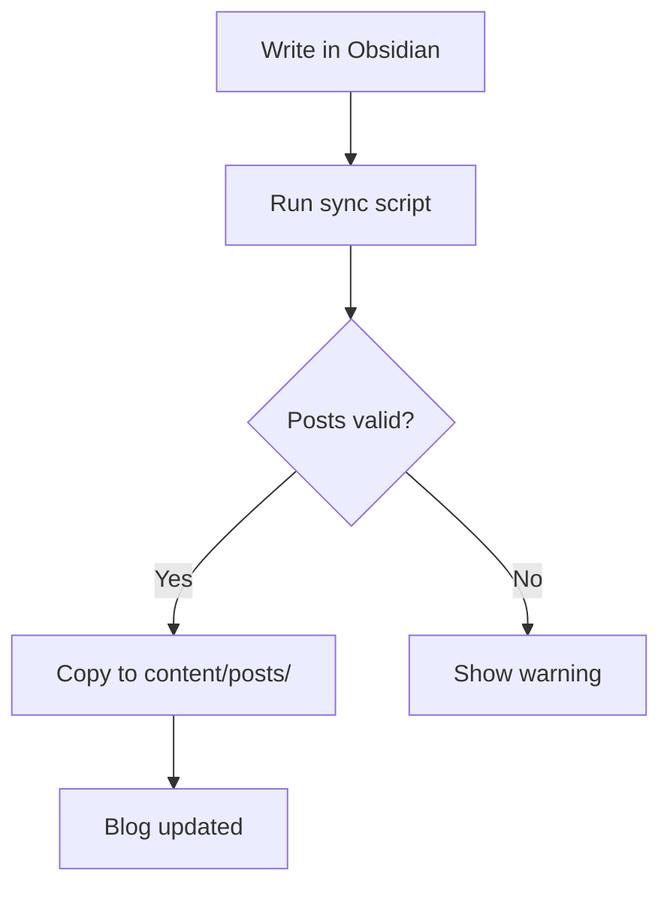
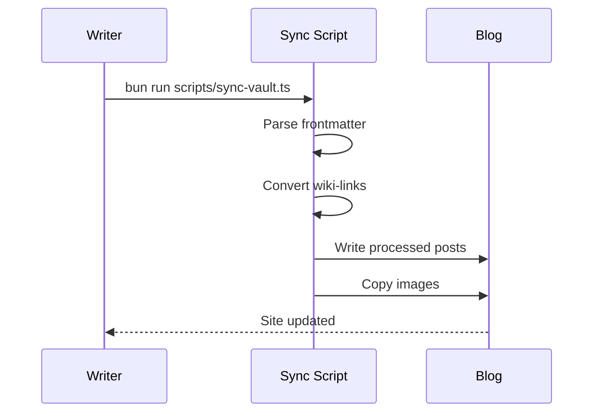

# Math and Diagrams

Second Brain supports LaTeX math (rendered client-side by KaTeX) and Mermaid diagrams. Both work with zero configuration.

## LaTeX Math

### Inline Math

Use single dollar signs for inline equations:

```markdown
The equation $E = mc^2$ shows mass-energy equivalence.
```

The equation $E = mc^2$ shows mass-energy equivalence.

### Block Math

Use double dollar signs for display equations:

```markdown
$$
\int_{-\infty}^{\infty} e^{-x^2} \, dx = \sqrt{\pi}
$$
```

$$
\int_{-\infty}^{\infty} e^{-x^2} \, dx = \sqrt{\pi}
$$

Block math supports all KaTeX macros: matrices, aligned equations, case statements, sums, products, and more.

### Advanced Examples

**Matrix:**

```markdown
$$
\begin{pmatrix} a & b \\ c & d \end{pmatrix}
$$
```

$$
\begin{pmatrix} a & b \\ c & d \end{pmatrix}
$$

**Aligned equations:**

```markdown
$$
\begin{aligned}
f(x) &= x^2 + 2x + 1 \\
     &= (x + 1)^2
\end{aligned}
$$
```

$$
\begin{aligned}
f(x) &= x^2 + 2x + 1 \\
     &= (x + 1)^2
\end{aligned}
$$

## Mermaid Diagrams

Use the `mermaid` language identifier in a fenced code block. The renderer converts it to an SVG diagram.

### Flowchart

````markdown

````

### Sequence Diagram

````markdown

````

### Supported Diagram Types

- **Flowcharts** — `graph TD`, `graph LR`
- **Sequence diagrams** — `sequenceDiagram`
- **Class diagrams** — `classDiagram`
- **State diagrams** — `stateDiagram-v2`
- **ER diagrams** — `erDiagram`
- **Gantt charts** — `gantt`
- **Pie charts** — `pie`
- **Mind maps** — `mindmap`
- **User journey** — `journey`

The full Mermaid syntax reference is at [mermaid.js.org](https://mermaid.js.org).

## Rendering Details

- **Math**: Rendered by KaTeX in the browser. No external API calls. Supports all standard LaTeX math notation.
- **Diagrams**: Rendered by Mermaid as SVG. Each diagram block is converted to an inline SVG image that inherits the page's text color, so diagrams work in both light and dark themes.

## Next Steps

- [[code-playground]] — Interactive code blocks with a Run button.
- [[writing-posts]] — Wiki-links, task lists, PDF embeds, and Ink.
- [[knowledge-graph]] — How posts connect through wiki-links.